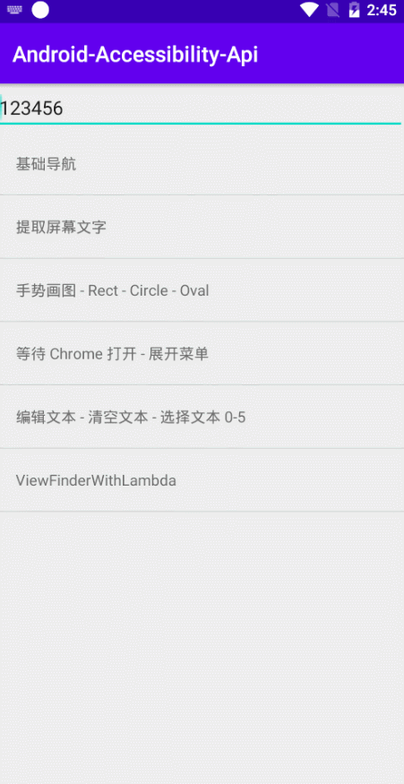
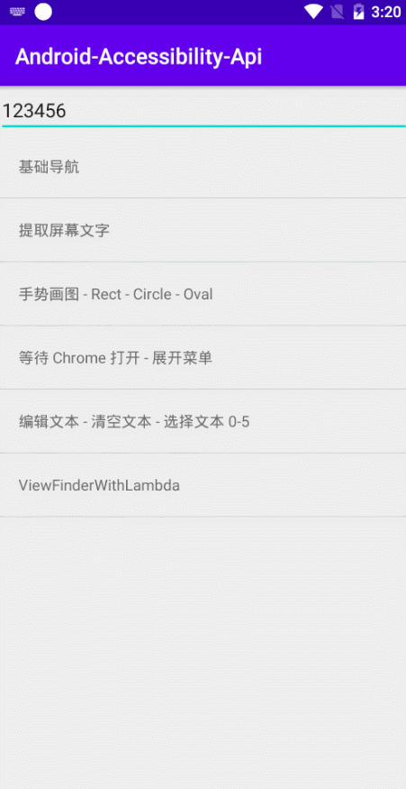
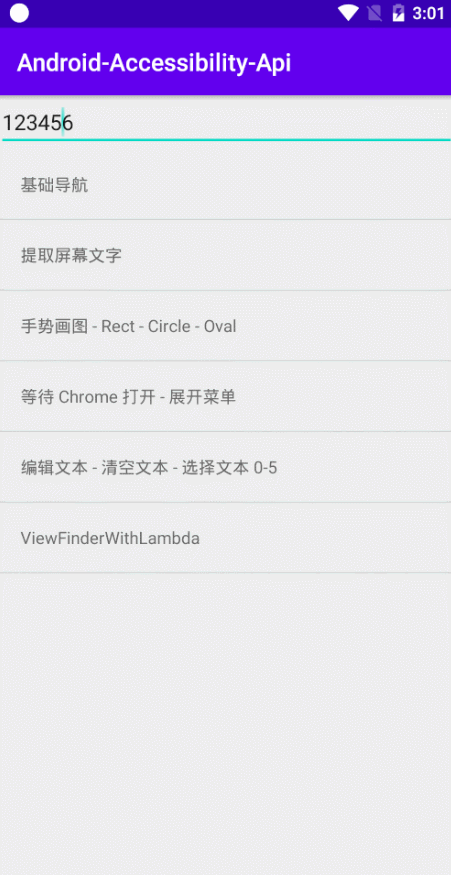
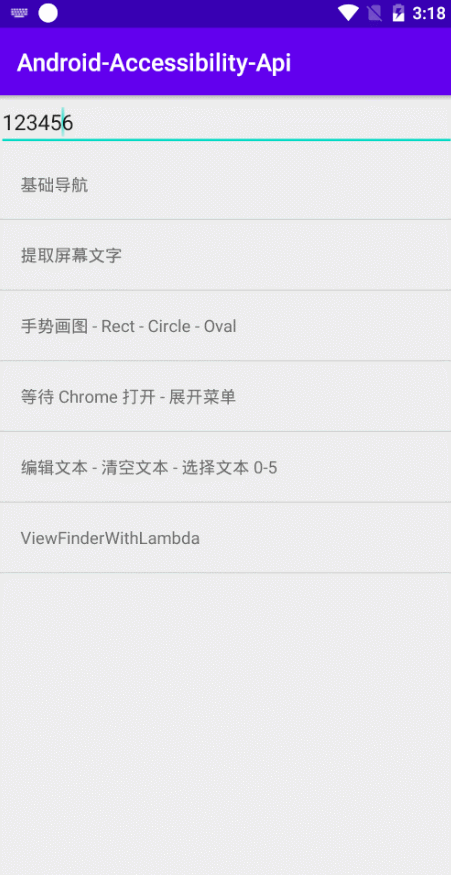
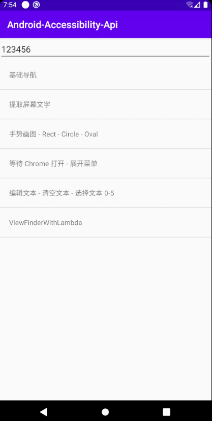

# Android-Accessibility-Api

中文 | [English](ReadMe_EN.md)

> 安卓无障碍服务Api, 为了简化无障碍服务使用，并使用 Kotlin 以提供简洁的Api。

[TOC]


## 基础导航

(图片加载过慢可到 [Gitee](https://www.gitee.com/Vove/Android-Accessibility-Api) 查看)

</img>


<details>
<summary>查看代码</summary>

```kotlin
//无障碍服务声明 未开启会跳转设置页面提示开启服务，并抛出异常 终止执行
requireBaseAccessibility()
toast("下拉通知栏..")
delay(1000)
toast("快捷设置..")
//操作之间需要适当延时等待
delay(1000)
//下拉通知栏快捷设置
quickSettings()
delay(1000)
//返回操作
back()
delay(500)
//返回操作
back()
delay(1000)
//电源菜单
powerDialog()
delay(500)
back()
delay(1000)
//进入最近任务页面
recents()
delay(1000)
back()
delay(1000)
//Home 按键 / 返回桌面
home()
delay(100)
```

</details>

更多操作:

| 方法          | 说明                        |
| ------------- | --------------------------- |
| lockScreen()  | 锁屏，需要Android P         |
| screenShot()  | 触发系统截屏，需要Android P |
| splitScreen() | 触发系统分屏，需要Android P |


## 视图检索

### 提取文字

</img>

```kotlin
requireBaseAccessibility()
//使用 ScreenTextFinder() 来搜索屏幕上的文字
val ts = ScreenTextFinder().find().joinToString("\n\n")

withContext(Dispatchers.Main) {
    AlertDialog.Builder(act).apply {
        setTitle("提取文字：")
        setMessage(ts)
        show()
    }
}
```

### 视图搜索

1. 提供一个基础类 `ViewFinder`， 并封装一个 `ViewFinderWithMultiCondition` 来指定搜索条件，实现快速搜索;查看所有方法：[view_finder_api.kt](accessibility-api/src/main/java/cn/vove7/andro_accessibility_api/api/view_finder_api.kt)

`ViewFinder` 主要方法：

|                             方法                             |                             说明                             |
| :----------------------------------------------------------: | :----------------------------------------------------------: |
|   findFirst(includeInvisible: Boolean = false): ViewNode?    | 立即搜索，返回满足条件的第一个结果<br>includeInvisible: 是否包含不可见元素 |
| findAll(includeInvisible: Boolean = false): Array\<ViewNode> |               立即搜索，返回满足条件的所有结果               |
|         waitFor(waitMillis: Long = 30000): ViewNode?         |   等待搜索，在指定时间内循环搜索（视图更新），超时返回null   |
|      require(waitMillis: Long = WAIT_MILLIS): ViewNode       |                       等待超时抛出异常                       |

**示例1：** 等待 Chrome 打开 > 展开菜单

</img>

```kotlin
//等待无障碍开启 默认时间30s，超时将抛出异常
waitBaseAccessibility()
toast("start chrome after 1s")
delay(1000)
//打开Chrome
val targetApp = "com.android.chrome"
act.startActivity(act.packageManager.getLaunchIntentForPackage(targetApp))
//等待页面
if (
    waitForApp(targetApp, 5000).also {
        toast("wait " + if (it) "success" else "failed")
    }
) {
    //id 搜索，点击打开菜单
    withId("menu_button").tryClick()
}
```

**示例2：** 文本操作

</img>

<details>
<summary>查看代码</summary>

```kotlin
requireBaseAccessibility()
//editor() 指定编辑框
editor().require().apply { // this is ViewNode
    repeat(5) {
        //追加文本
        appendText(".x")
        delay(500)
    }
    delay(1000)
    //清空文本
    text = ""
    delay(1000)
    //设置文本
    text = "123456"
    delay(1000)
    //选择文本
    setSelection(0, 5)
    delay(1000)
	//清除选择
    clearSelection()
    //失去焦点
    clearFocus()
}
```
</details>


2. 提供自定义搜索条件 `CustomViewFinder`

搜索所有可点击的视图：

</img>


```kotlin
requireBaseAccessibility()
//自定义条件搜索
val s = findAllWith { it: AccessibilityNodeInfo -> 
    it.isClickable
}.joinToString("\n\n")

withContext(Dispatchers.Main) {
    AlertDialog.Builder(act).apply {
        setTitle("可点击节点：")
        setMessage(s)
        show()
    }
}
```

   

## 视图节点(ViewNode)

根据视图搜索得到 `ViewNode`，可进行的操作详见接口：[ViewOperation.kt](accessibility-api/src/main/java/cn/vove7/andro_accessibility_api/viewnode/ViewOperation.kt)

## 全局手势

全局手势可以点击/长按任意坐标，执行路径手势。

### 示例

</img>

<details>
<summary>查看代码</summary>

```kotlin
class DrawableAction : Action {
    override val name: String
        get() = "手势画图 - Rect - Circle - Oval"

    @RequiresApi(Build.VERSION_CODES.N)
    override suspend fun run(act: Activity) {
        requireBaseAccessibility()
        requireGestureAccessibility()
        act.startActivity(Intent(act, DrawableActivity::class.java))
        toast("1s后开始绘制，请不要触摸屏幕")
        delay(1000)

        //设置相对屏幕 非必须
        setScreenSize(500, 500)
        //指定点转路径手势
        gesture(
            2000L, arrayOf(
                100 t 100,
                100 t 200,
                200 t 200,
                200 t 100,
                100 t 100
            )
        )
        delay(800)
        //点击clear按钮
        withText("clear").tryClick()
        //使用Path
        drawCircle()
        delay(800)
        withText("clear").tryClick()
        drawOval()
    }

    @RequiresApi(Build.VERSION_CODES.N)
    fun drawCircle() {
        val p = Path().apply {
            //此处路径坐标为绝对坐标
            addOval(RectF(500f, 500f, 800f, 800f), Path.Direction.CW)
        }
        gesture(2000L, p) {
            toast("打断")
        }
    }

    //AdapterRectF 会根据设置的相对屏幕大小换算
    @RequiresApi(Build.VERSION_CODES.N)
    fun drawOval() {
        val p = Path().apply {
            //使用AdapterRectF 会根据设置的相对屏幕尺寸将坐标转换
            addOval(AdapterRectF(200f, 200f, 300f, 300f), Path.Direction.CW)
        }
        gesture(2000L, p)
    }

    infix fun <A, B> A.t(that: B): Pair<A, B> = Pair(this, that)
}

```

</details>

### Api文档

**手势Api全部需要Android N+；代码必须执行于非主线程**

<details>
<summary>展开查看</summary>

| 方法                                                         | 说明                        |
| :----------------------------------------------------------- | :-------------------------- |
| fun setScreenSize(width: Int, height: Int)                   | 设置屏幕相对坐标            |
| fun gesture(<br>     duration: Long, <br>     points: Array<Pair<Int, Int>>,<br>     onCancel: Function0<Unit>? = null <br>): Boolean | 根据点坐标生成路径 执行手势 |
| fun gesture(<br>     duration: Long,<br>     path: Path,<br>     onCancel: Function0<Unit>? = null <br>): Boolean | 根据Path执行手势            |
| fun gestureAsync(<br>     duration: Long,<br>     points: Array<Pair<Int, Int>> <br>) | 异步执行手势                |
| fun gestures(<br>     duration: Long,<br>     ppss: Array<Array<Pair<Int, Int>>>,<br>     onCancel: Function0<Unit>? = null <br>): Boolean | 多路径手势                  |
| fun click(x: Int, y: Int)                                | 点击； x,y 相对坐标         |
| fun longClick(x: Int, y: Int)                                | 长按； x,y 相对坐标         |
| fun swipe(x1: Int, y1: Int, x2: Int, y2: Int, dur: Int)      | 两点间滑动                  |
| fun scrollUp(): Boolean                                      | 向上滑动                    |
| fun scrollDown(): Boolean                                    | 向下滑动                    |

</details>


## 使用

由于部分系统版本启动支持手势的无障碍服务会造成系统卡顿(掉帧)，所以本库分为两个服务来设计（若无需手势功能，可不实现手势服务）。

### 引入 Android-Accessibility-Api

1. Add it in your root build.gradle at the end of repositories:

```groovy
allprojects {
	repositories {
		...
		maven { url 'https://jitpack.io' }
	}
}
```

2. Add the dependency

```groovy
dependencies {
	implementation 'com.github.Vove7:Android-Accessibility-Api:Tag'
}
```

the TAG is [](https://jitpack.io/#com.github.Vove7/Android-Accessibility-Api)

### 创建你的服务

#### 基础服务

用来支持 布局检索，视图操作

1. 定义你的 BaseAccessibilityService

<details>
<summary>展开查看 BaseAccessibilityService </summary>

```kotlin
class BaseAccessibilityService : AccessibilityApi() {

    //启用 页面更新 回调
    override val enableListenAppScope: Boolean = true
    
    //页面更新回调
    override fun onPageUpdate(currentScope: AppScope) {
        Log.d("TAG", "onPageUpdate: $currentScope")
    }
}
```

</details>

2. 服务注册

```xml
<service
    android:name=".service.BaseAccessibilityService"
    android:description="@string/base_ser_desc"
    android:label="BaseService Demo"
    android:permission="android.permission.BIND_ACCESSIBILITY_SERVICE">
    <intent-filter>
        <action android:name="android.accessibilityservice.AccessibilityService" />
    </intent-filter>
    <meta-data
        android:name="android.accessibilityservice"
        android:resource="@xml/base_accessibility_config" />
</service>
```

3. base_accessibility_config.xml

<details>
<summary>点击展开 res/xml/base_accessibility_config.xml</summary>


```xml
<?xml version="1.0" encoding="utf-8"?>
<accessibility-service xmlns:android="http://schemas.android.com/apk/res/android"
    android:accessibilityEventTypes="typeWindowStateChanged"
    android:accessibilityFeedbackType="feedbackAllMask"
    android:accessibilityFlags="flagIncludeNotImportantViews|flagReportViewIds|flagRetrieveInteractiveWindows|flagRequestEnhancedWebAccessibility"
    android:canRetrieveWindowContent="true"
    android:description="@string/base_ser_desc"
    android:notificationTimeout="10"
    android:canRequestEnhancedWebAccessibility="true"
    android:settingsActivity=".MainActivity"
    android:summary="基础导航/视图检索操作"/>
<!--    android:canRequestFilterKeyEvents="true"-->
<!--flagRequestFilterKeyEvents-->
```

</details>

#### 手势服务

> 用于执行手势，Android N+可用

1. 定义 GestureAccessibilityService

<details>
<summary>展开查看 GestureAccessibilityService </summary>

```kotlin
class GestureAccessibilityService : AccessibilityService() {
    override fun onCreate() {
        super.onCreate()
        //must call
        AccessibilityApi.gestureService = this
    }
    override fun onDestroy() {
        super.onDestroy()
        //must call
        AccessibilityApi.gestureService = null
    }
    override fun onInterrupt() {}
    override fun onAccessibilityEvent(event: AccessibilityEvent?) {}
}
```

</details>

2. 服务注册

```xml
<service
    android:name=".service.GestureAccessibilityService"
    android:description="@string/ges_ser_desc"
    android:label="Gesture Service Demo"
    android:permission="android.permission.BIND_ACCESSIBILITY_SERVICE">
    <intent-filter>
        <action android:name="android.accessibilityservice.AccessibilityService" />
    </intent-filter>
    <meta-data
        android:name="android.accessibilityservice"
        android:resource="@xml/gesture_accessibility_config" />
</service>
```

3. gesture_accessibility_config.xml

<details>
<summary>点击展开 res/xml/gesture_accessibility_config.xml</summary>


和基础服务配置区别仅为 `android:canPerformGestures="true"`

```xml
<accessibility-service xmlns:android="http://schemas.android.com/apk/res/android"
    android:accessibilityEventTypes=""
    android:accessibilityFeedbackType=""
    android:accessibilityFlags=""
    android:canPerformGestures="true"
    android:canRetrieveWindowContent="false"
    android:description="@string/ges_ser_desc"
    android:notificationTimeout="10"
    android:packageNames=""
    android:settingsActivity=".MainActivity"
    android:summary="执行手势" />
```

</details>

### 额外配置 

在 Application 中初始化：

**指定 `BASE_SERVICE_CLS` 及 `GESTURE_SERVICE_CLS`**

```kotlin
override fun onCreate() {
    super.onCreate()
    AccessibilityApi.apply {
        BASE_SERVICE_CLS = BaseAccessibilityService::class.java
        GESTURE_SERVICE_CLS = GestureAccessibilityService::class.java
    }
}
```


### 合并服务

如果你想使用一个服务来完成，可使用如下配置


1. 创建服务

```kotlin
class MyAccessibilityService : AccessibilityApi() {
    //启用 页面更新 回调
    override val enableListenAppScope: Boolean = true
    override fun onCreate() {
        //同时设置
        baseService = this
        AccessibilityApi.gestureService = this
        super.onCreate()
    }
    override fun onDestroy() {
        //同时设置
        baseService = null
        AccessibilityApi.gestureService = null
        super.onDestroy()
    }
    //页面更新回调
    override fun onPageUpdate(currentScope: AppScope) {
        Log.d("TAG", "onPageUpdate: $currentScope")
    }
}
```


2. 清单注册

```xml
<service
    android:name=".service.MyAccessibilityService"
    android:description="@string/ser_desc"
    android:label="Service Demo"
    android:permission="android.permission.BIND_ACCESSIBILITY_SERVICE">
    <intent-filter>
        <action android:name="android.accessibilityservice.AccessibilityService" />
    </intent-filter>
    <meta-data
        android:name="android.accessibilityservice"
        android:resource="@xml/accessibility_config" />
</service>
```

3. `res/xml/accessibility_config.xml`


<details>
<summary>点击展开 accessibility_config.xml</summary>


```xml
<?xml version="1.0" encoding="utf-8"?>
<accessibility-service xmlns:android="http://schemas.android.com/apk/res/android"
    android:accessibilityEventTypes="typeWindowStateChanged"
    android:accessibilityFeedbackType="feedbackAllMask"
                       android:accessibilityFlags="flagIncludeNotImportantViews|flagReportViewIds|flagRetrieveInteractiveWindows|flagRequestEnhancedWebAccessibility"
    android:canRetrieveWindowContent="true"
    android:description="@string/base_ser_desc"
    android:notificationTimeout="10"
    android:canPerformGestures="true"
    android:canRequestEnhancedWebAccessibility="true"
    android:settingsActivity=".MainActivity"
    android:summary="基础导航/视图检索操作"/>
<!--    android:canRequestFilterKeyEvents="true"-->
<!--flagRequestFilterKeyEvents-->
```

</details>

4. Application 初始化配置 

```kotlin
AccessibilityApi.apply {
    BASE_SERVICE_CLS = MyAccessibilityService::class.java
    GESTURE_SERVICE_CLS = MyAccessibilityService::class.java
}
```

----------------------------

更多 `Api` 可在下列文件查看

- [view_finder_api.kt](accessibility-api/src/main/java/cn/vove7/andro_accessibility_api/api/view_finder_api.kt)
- [gesture_api.kt](accessibility-api/src/main/java/cn/vove7/andro_accessibility_api/api/gesture_api.kt)
- [nav_api.kt](accessibility-api/src/main/java/cn/vove7/andro_accessibility_api/api/nav_api.kt)
- [nav_api.kt](accessibility-api/src/main/java/cn/vove7/andro_accessibility_api/api/nav_api.kt)
- [ViewNode](accessibility-api/src/main/java/cn/vove7/andro_accessibility_api/viewnode/ViewNode.kt)
